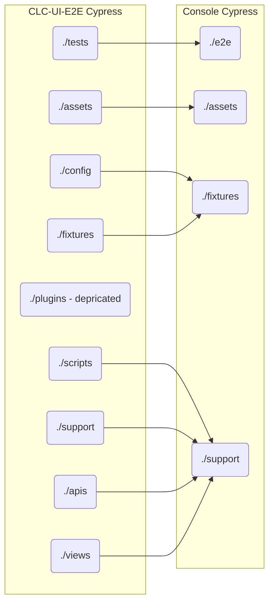

# Cypress Migration Doc

## Migration directory targets

Below is a flow chart depicting, roughly, how code will be reorganized as it is migrated from clc-ui-e2e into console's cypress library.

## Rationale

We aim to align the Console's cypress library more closely with reccommend conventions. In practice, this means making the most of the suggested top-level structure before adding new, potentially more complicated, top-level directories.

## ./e2e

Contains spec files or tests, used for our e2e.

## ./assets

Contains data that is generated by the test, including screenshots and video recordings.

## ./fixtures

Contains external data or config data that is consumbed by our tests. Typically this is data that not to be hard-coded into tests.

## ./support

Contains code that the cypress preprocessor will run before each spec file (in files `./support/e2e.js` or `./support/component.js`, _formerly `index.js`_), as well as any reusable behavior in the code (helper functions), and custom cypress functions.
