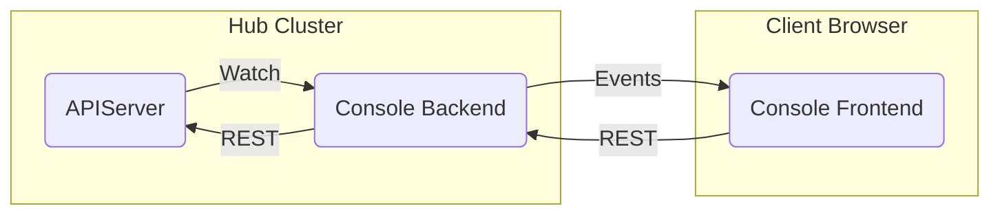

[comment]: # ( Copyright Contributors to the Open Cluster Management project )

# Console Architecture

## Console Frontend

The console frontend is a static single page application.
Resources from the backend are automatically stored and updated globally in `recoil` `atoms`.
All data is stored in memory.
All calls from the frontend to work with resources should use the resource utility functions. i.e. `createResource()`
The frontend should use PatternFly controls without modifying the look and feel of the controls using CSS.

## Console Backend

The console backend uses a service account to `list` and `watch` kubernetes cluster resources.
Resource events are streamed to the console frontend.
RBAC is enforced using the token passed from the console frontend.
All resources are checked for access using `SubjectAccessReview` calls to the cluster.

The console backend proxies the cluster apiserver `/api` and `/apis` apiserver REST routes.
All REST calls use the token passed from the console frontend.
