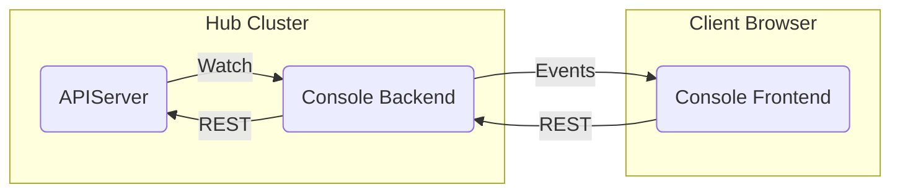

[comment]: # ( Copyright Contributors to the Open Cluster Management project )

# Console Architecture

```mermaid
flowchart LR
    subgraph Hub Cluster
    A(APIServer)
    B(Console Backend)
    A -- Watch --> B
    B -- REST --> A
    end
    subgraph Client Browser
    F(Console Frontend)
    end
    B -- Events --> F
    F -- REST --> B
```

## Console Frontend

The console frontend is a static single page application.
Resources from the backend are automatically stored and updated globally in `recoil` `atoms`.
All data is stored in memory.
All calls from the frontend to work with resources should use the resource utility functions. i.e. `createResource()`.
The frontend should use PatternFly components without modifying the look and feel of the controls using CSS.

The frontend has two builds. One for the stand alone version and one for the dynamic plugin version that is dynamically loaded into the OCP Console.

## Console Backend

The public listener is a Go process (`backend/`). Hub kube-apiserver passthrough routes (`/api`, `/apis`, `/version`), managed-cluster, metrics, VirtualMachine proxy, Search proxy, and long-tail HTTP (ROSA wizard, Ansible Tower, placement-debug, upgrade-risks) are served natively in Go. The plugin and browser keep talking to the same Service and paths.

The console backend uses a service account to `list` and `watch` kubernetes cluster resources.
Resource events are streamed to the console frontend.
RBAC is enforced using the token passed from the console frontend.
All resources are checked for access using `SubjectAccessReview` calls to the cluster.

The console backend proxies the cluster apiserver `/api` and `/apis` apiserver REST routes from the Go public listener (`backend/internal/k8sproxy`).
All REST calls use the token passed from the console frontend.

Standalone login (`GET /login`, `/login/callback`, `/logout`) is served by the Go listener in non-production. `GET /configure` returns `{ token_endpoint }` from OAuth/OIDC discovery for frontend logout and the Display Token page. The cookie `acm-access-token-cookie` (HttpOnly, Path=/, Secure in production) holds the OpenShift access token or OIDC id_token. Production plugin mode continues to use OpenShift Console authentication.

The Go listener runs a client-go informer cache (`backend/internal/informers`) from `DefaultWatchSpecs()` in `backend/internal/informers/specs.go`. `GET /events` is served by Go (`backend/internal/events/hub`) with per-user SelfSubjectAccessReview filtering (60s cache). `POST /aggregate/{applications,statuses,appSetData}` is served by Go (`backend/internal/aggregate`) from that cache plus an in-cluster Search GraphQL client (service-account token). `POST /proxy/search` and the Search graphql-ws relay are served by Go (`backend/internal/searchproxy`) with the user token. ROSA wizard, `POST /ansibletower`, `POST /placement-debug`, and `POST /upgrade-risks-prediction` are served by Go (`backend/internal/rosa`, `ansibletower`, `placementdebug`, `upgraderisks`). The Go store holds `unstructured.Unstructured` (managedFields stripped except Policy). Development builds expose `GET /debug/informer-snapshot`. `GET /events/rbac` remains a separate ClusterRole informer.

DELETED resource events are sent to every SSE client without an access check. That is a known quirk to fix later.

Static plugin assets (`plugin-manifest.json`, `plugin-entry.js`, hashed JS/CSS, locales) are served by the Go listener with cache headers, CSP, and brotli/gzip content negotiation.
